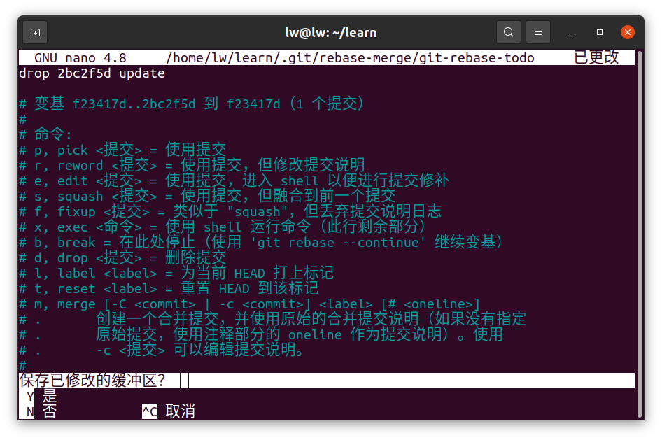
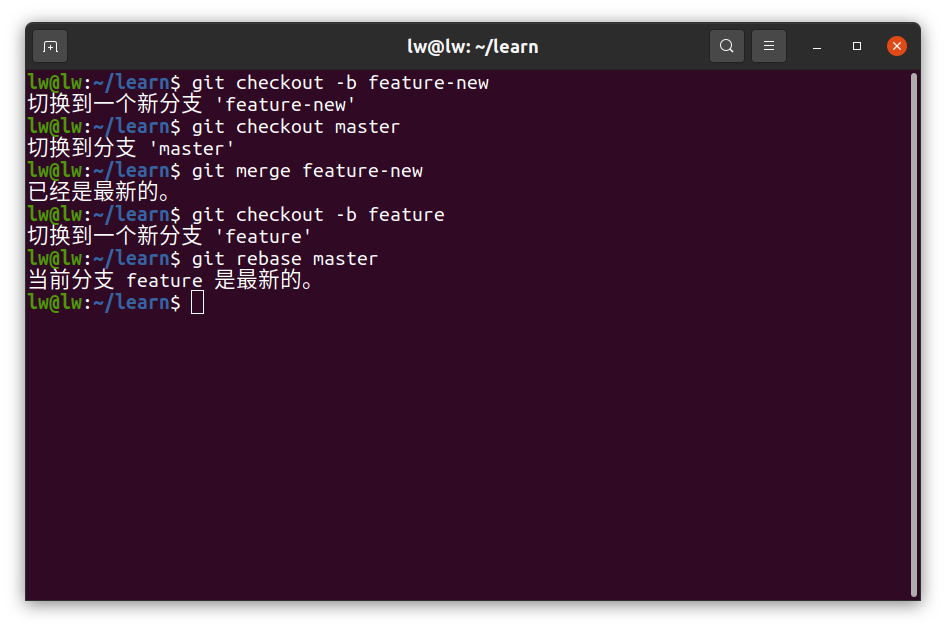

# Q1
##  	1.使用git restore命令

​			**如下图**

## 2.使用git checkout命令

​			**如下图**

# Q2

## *不修改历史*

## 	1.使用git revert HEAD命令，回退到最新版本

​			**如下图**

### 			**提交并更新版本**

### 			回退

## 	2.使用checkout命令

​		**如下图**

### 		git log获取版本号，再回退至该版本

## *修改历史*

## 1.使用git reset --soft命令

​		**如下图**

## 	git log获取版本号再回退

## 2.使用git rebase指令

​		**如下图**

## 	输入git rebase指令后修改 pick 为 drop

# Q3

# 使用merge和rebase指令合并

