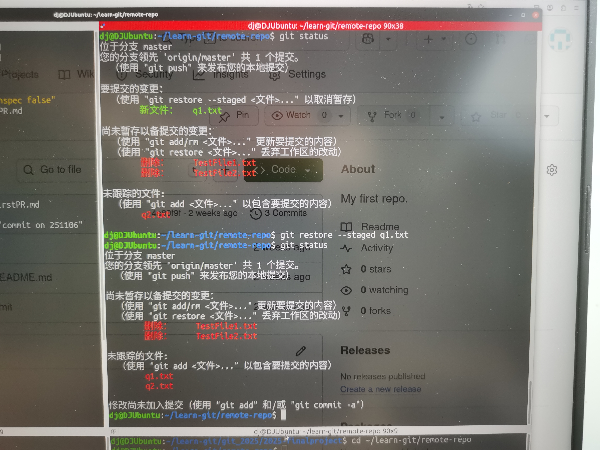
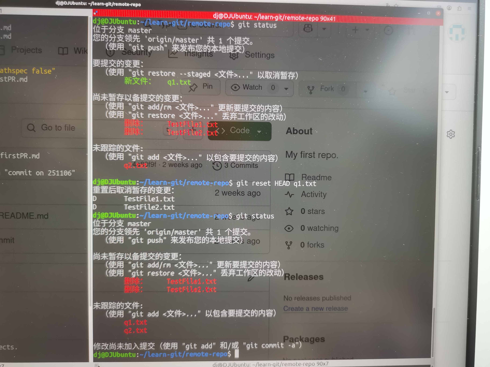
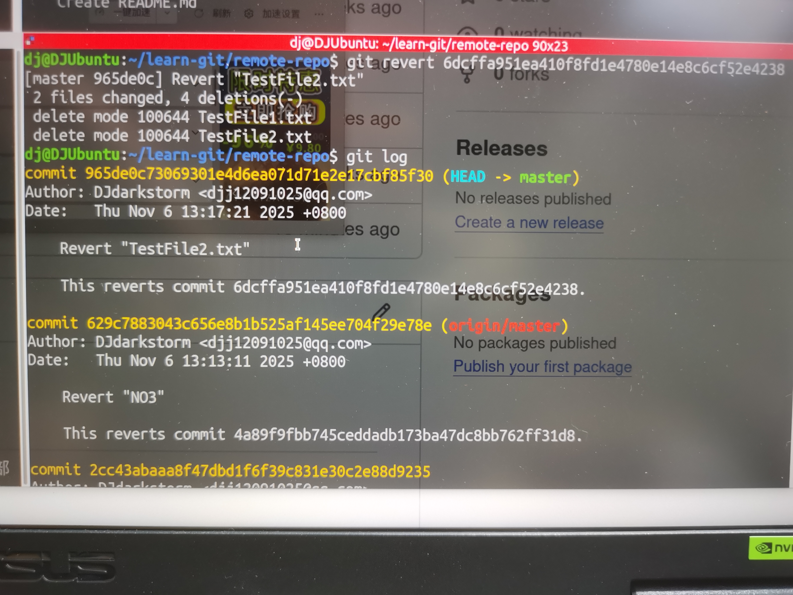
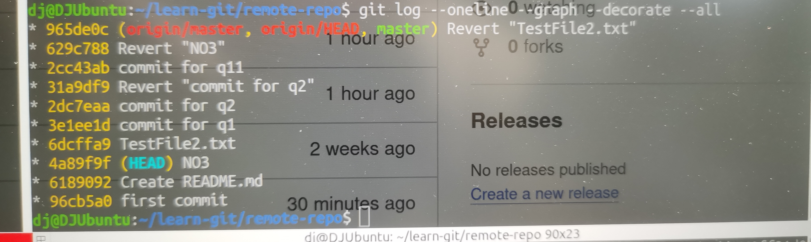
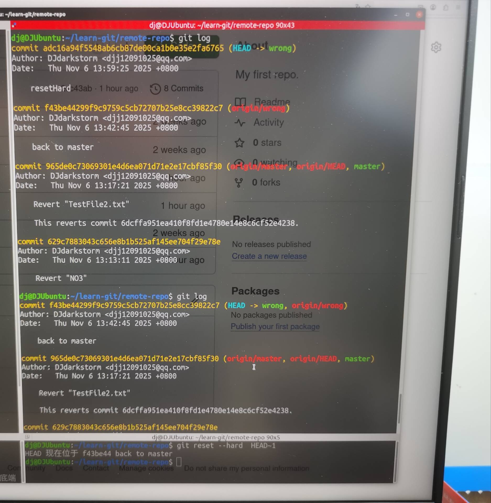
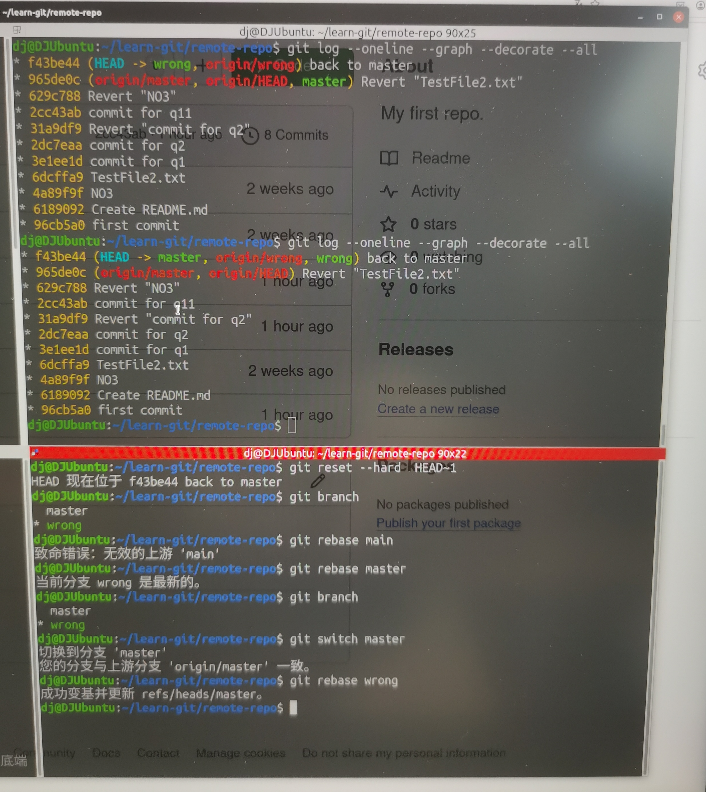
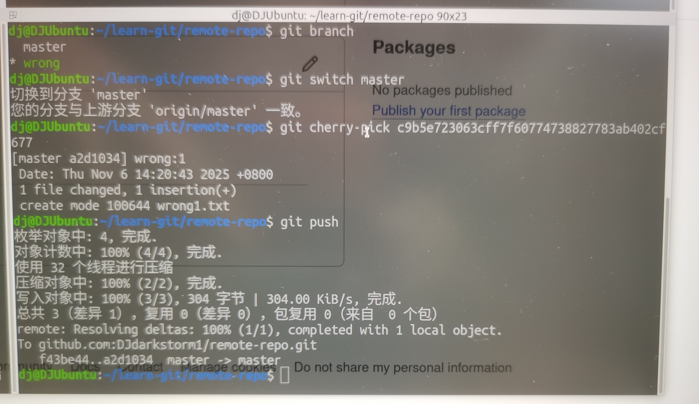

**Git应用**

*NO.1*

1.使用 "git restore --staged <文件>..." 以取消暂存[图片2]

2.git reset HEAD <文件>回退暂存区到工作区[图片1]

*NO.2*
(不修改历史)

1.git revert <commit-hash>回到指定哈希值的历史[图片3]

2.git checkout <commit-hash>分离头指针到制定哈希值的位置(在另一个分支)[图片4.5]

(修改历史)

1.git reset --hard  HEAD~1回到上一次提交，并删掉前面的历史[图片6]

2.gir reset --hard <commit-hash>回到指定哈希的历史，并删掉前面的历史

*NO.3*

1.git switch master
  git rebase <分支名>将分支加到master上

  git switch <分支名>
  git rebase master 将master的部分加到<分支名>上，使其成为线性的[图片7]

2.git cherry-pick <commit-hash>将指定的提交合并到当前分支[图片8]

DJ20251106
