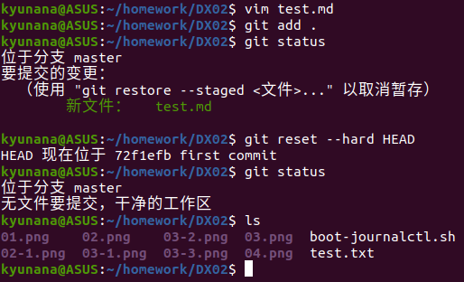
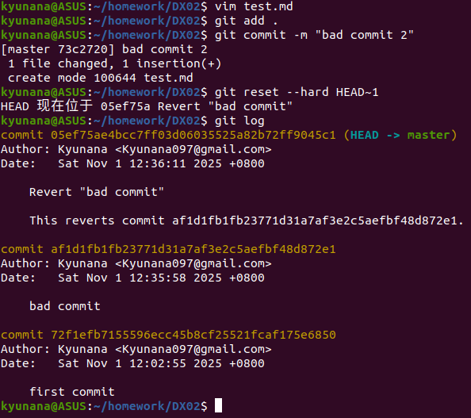
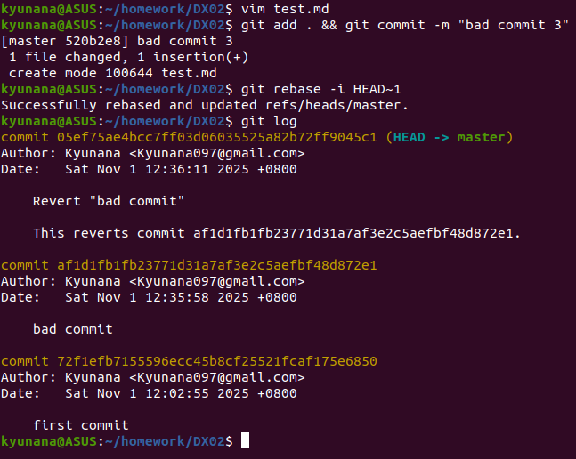
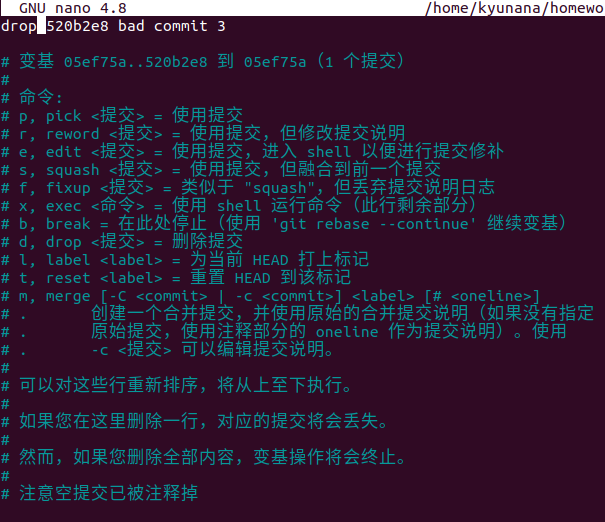
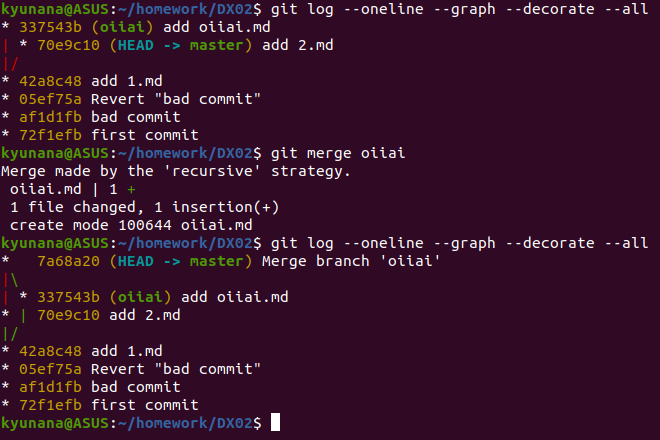
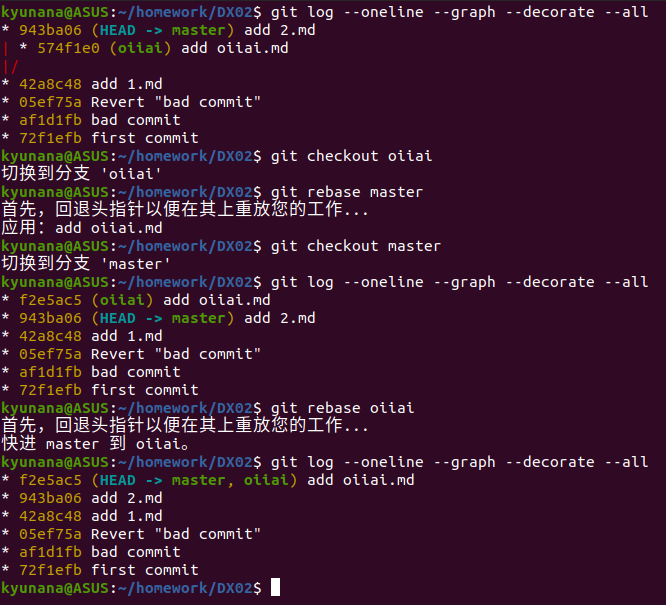
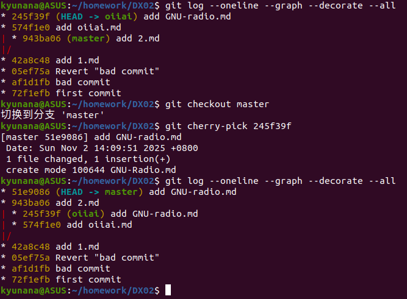

# 森莫 泥还不会用GIT？
## 若你已经修改了部分文件、并且将其中的一部分加入了暂存区，应该如何回退这些修改，恢复到修改前最后一次提交的状态？给出至少两种不同的方式
看来目前我们搓出了一坨达芬，还不小心git add .了  
1. git reset  
    那么作为暴躁的程序员，肯定是选择  
    ~~~
    git reset --hard HEAD
    ~~~
    一气呵成回到上个commit，完成了*今天又白干了*的成就  
    什么，你说你还想要留一点下来？ 
    那么就先把**暂存区清空**，再一个个checkout
    ~~~
    git reset HEAD
    git checkout -- <file> [<file> ...]
    ~~~
    
    <center>git reset演示</center>
 2. git restore  
    什么，你说你是专业的不能这么搞？那来看看这个  
    ~~~
    git restore --source=HEAD --staged --worktree .  #同时覆盖工作区和暂存区
    ~~~
    这个新命令语义更清晰，也可以指定文件进行操作，相当于原来的`git reset HEAD <file> && git checkout -- <file>`
    
    <center>git restore演示</center>
## 若你已经提交了一个新版本，需要回退该版本，应该如何操作？分别给出不修改历史或修改历史的至少两种不同的方式
看来这回你把达芬给commit了，发现不好用之后又想要后悔
1. 不修改历史（在坏提交后面直接提交）
    ~~~
    git revert --no-edit HEAD
    ~~~
    该代码会自动把上一个提交拿过来再commit一遍，以便你对这次坏提交留档保存
    
    <center>git revert演示</center>
2. 修改历史（丢掉坏提交）
   ~~~
    git reset --hard HEAD~1
    git push origin <branch> --force-with-lease 
   ~~~
    ~~如果你害怕提交达芬被队长拷打的话~~，可以使用以上方法直接丢掉上次提交  
    当然，别忘了``--force-with-lease ``，它会在push前检查当前的commit SHA，若远程不是这个SHA（有人抢先你一步commit了），那么命令会终止，~~防止你和其他队员干起来~~
    
    <center>git reset演示</center>

    若你还没有push坏提交，而只是在本地进行commit的话，也可以试试``git rebase``，
    ```
    git rebase --drop HEAD~1 --onto HEAD~2
    ```
    或者使用``
    git rebase -i HEAD~n``进行可视化编辑
    
    <center>git rebase演示</center>

    
    <center>git rebase可视化界面</center>

## 我们已经知道了合并分支可以使用 merge，但这不是唯一的方法，给出至少两种不同的合并分支的方式
太好了，看来你历经重重折磨之后终于可以将分支merge到main了！真是皆大欢喜  

<center>直接使用git merge</center>
又出问题了？队友弔你说垃圾合并太多把历史变成达芬了？只是有几个文件想合并，不想动一整个分支？  

~~别怕，是技术性调整~~  
1. git rebase  
    直接使用rebase把另一个分支上的所有东西都搬到main上，最后再合并，就可以获得线性的历史了
    ```
    git checkout feature
    git rebase main        # 把 feature 提交逐个搬到 main 最新之后
    git checkout main
    git rebase feature     # 快进main
    ```
    ~~这种操作仅适用于个人整理私有分支，不要对队友的分支下手哦~~
    
    <center>git rebase演示</center>
2. git cherry-pick
   这个方法适用于合并指定文件（当然你使用`^`把所有文件都塞进去那我也没办法，算你牛比），例如主分支急需的补丁，非常有用的文件等
   ```
    git checkout master
    git cherry-pick <commit-hash>
   ```
   
    <center>git cherry-pick演示</center>
