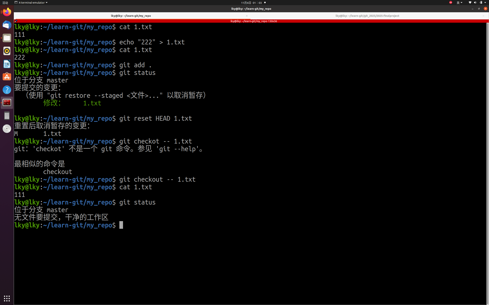
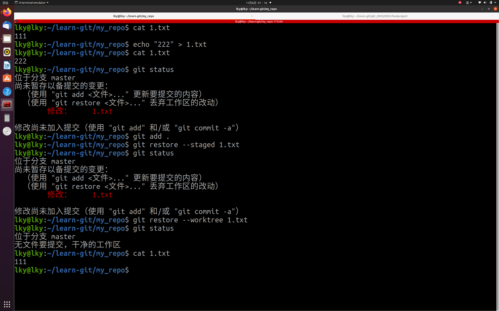
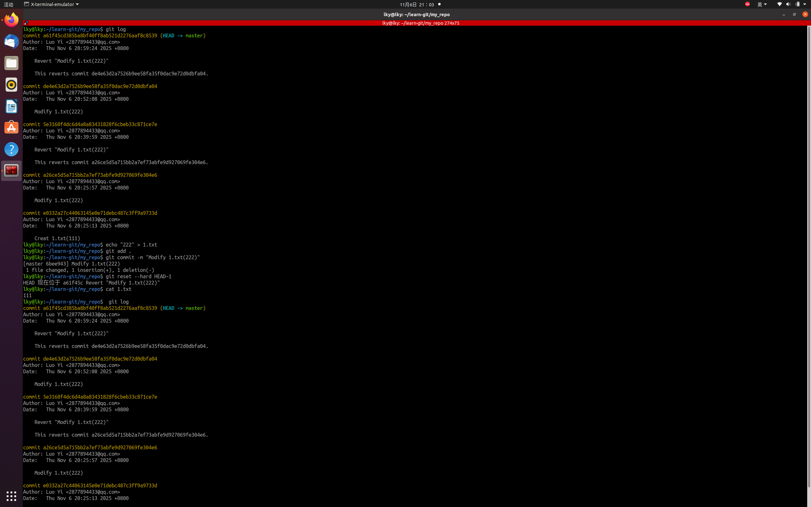

#第一题
1. 使用git reset HEAD <指定文件> 回退暂存区修改，git checkout --<指定文件> 回退工作区修改。

2. 使用git restore --staged <指定文件>回退暂存区修改，git restore (--worktree )<指定文件> 回退工作区修改。

#第二题

##保留记录
1. 使用git revert <上版本哈希码>。

.png)

2. 使用git revert HEAD。

.png)

##不保留记录
1. 使用git reset --hard HEAD~1 回退版本并且不保存工作区和暂存区内容。

2. git rebase -i HEAD~1 修改提交，使用drop(d)来替代pick。

.png)

.png)

#第三题
1. 使用git merge <分支名> ，合并差异。

2. 使用git rebase <分支名>，把目标分支版本嫁接到当前线路。

