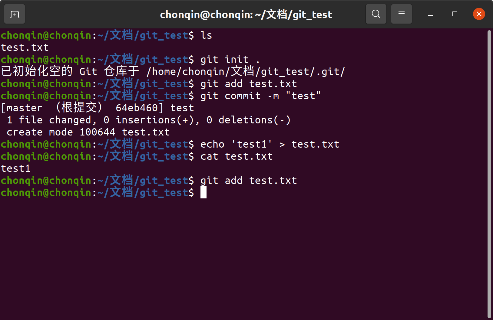
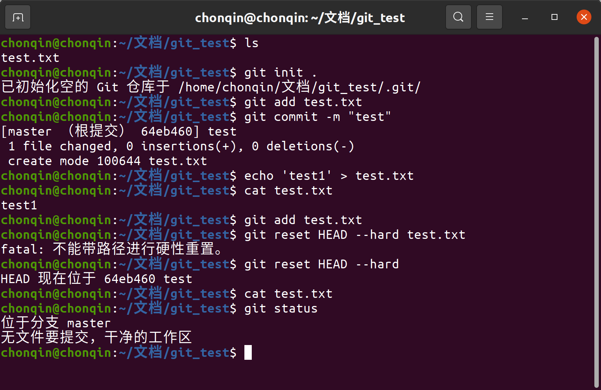
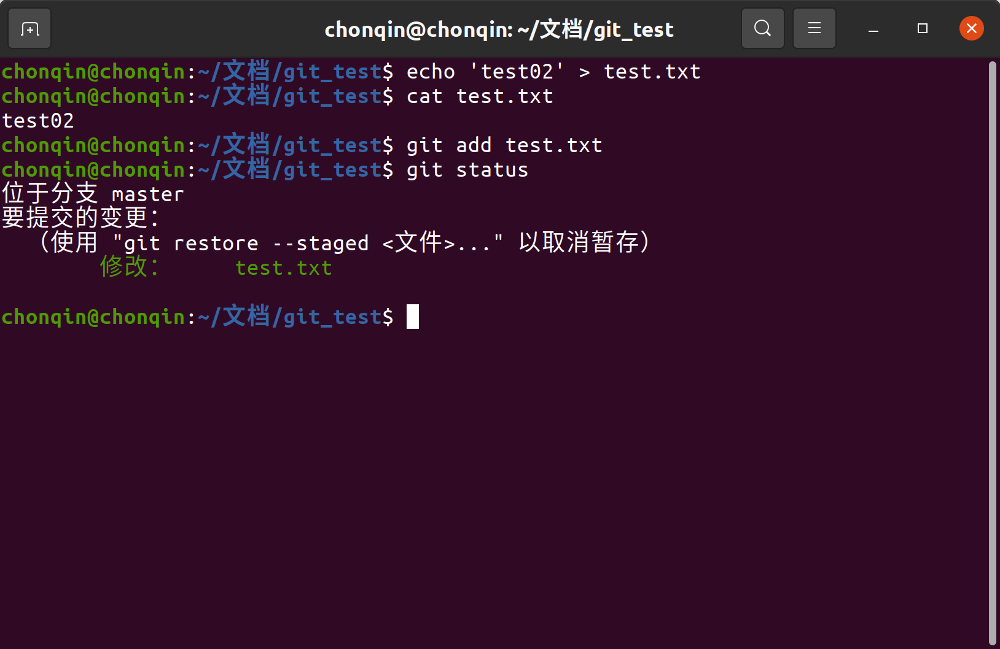
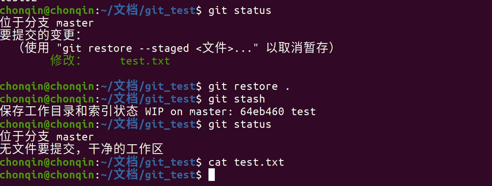
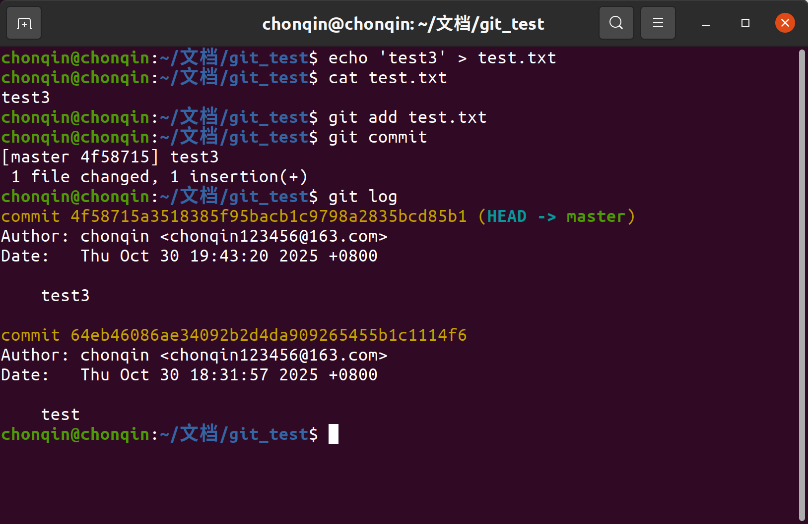
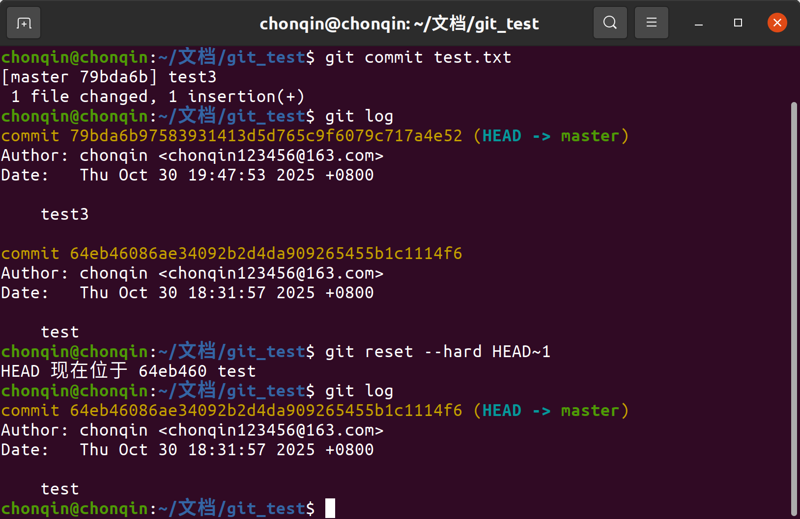
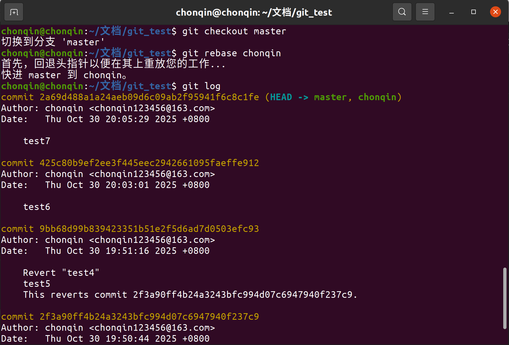
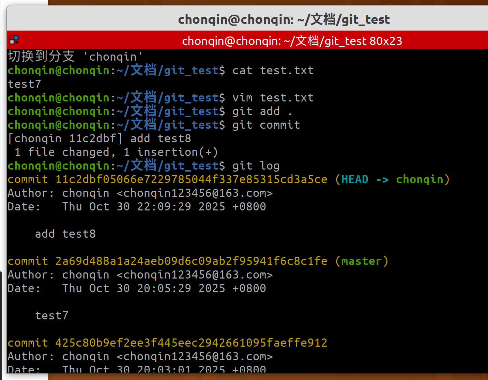
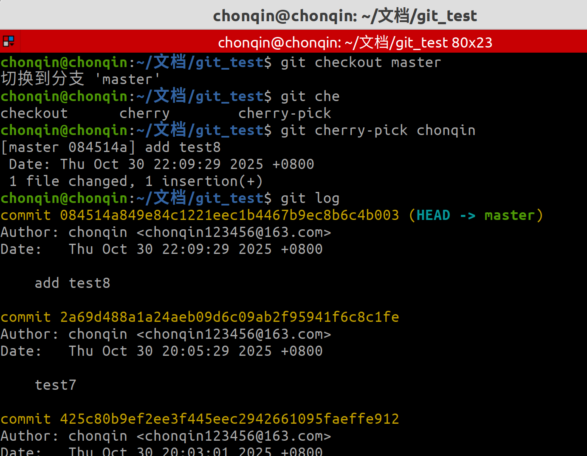

# git_answer

## 问题1

若你已经修改了部分文件、并且将其中的一部分加入了暂存区，应该如何回退这些修改，恢复到修改前最后一次提交的状态？给出至少两种不同的方式

### 解答

- 方法一：

    ```shell
    git reset HEAD --hard 
    ```

    

​	首先，初始化git仓库，并完成初次的提交后，更改文件内容后又添加到了工作区，现在使用命令撤回修改。		



使用命令后，会清除暂存区的提交，并且清除工作区的更改内容。

- 方法二：	

```shell
git restore  <文件>
# 或者对整个工作区回退
git restore .
```





可以看到，操作成功。暂存区删除并且工作区的修改内容也回退成功。

## 问题2

若你已经提交了一个新版本，需要回退该版本，应该如何操作？分别给出不修改历史或修改历史的至少两种不同的方式

### 解答

- 修改历史：

    意味着删除这个提交的版本，并且历史内没有这个提交。

    ```shell
    git reset --hard HEAD~1
    # 后面的~1代表着完全回退到上一版本，并且log内没有此次commit的历史
    ```

    



- 不修改历史：

    回退了上一次的版本，但是历史中有记录。

    ```shell
    git revert HEAD
    # 通过创建一个新的“反向变更”的提交来撤销某次历史提交
    ```

    

​	

可以看到，执行后，任然保留了上一次commit的历史记录。

## 问题三

我们已经知道了合并分支可以使用 merge，但这不是唯一的方法，给出至少两种不同的合并分支的方式

### 解答

- 方法一：

```shell
# 假如现有master和chonqin两个分支
# 切换到你想合并到的目标分支
git checkout master
# 将 feature 分支的提交重放到 master 分支上
git rebase chonqin

```

我在master分支提交了修改‘test6’，chonqin分支提交了修改‘test7’，使用rebase后：



可以看到，在chonqin分支上也显示出了test7。

- 方法二：

    ```shell
    git cherry-pick <commitHash>
    # 上面命令就会将指定的提交commitHash，应用于当前分支
    git cherry-pick feature
    # 将feature分支的最近一次提交，转移到当前分支
    ```



先在chonqin分支修改并且提交了‘test8’。



使用git cherry-pick命令后，就将最近一次chonqin的修改添加到了master上了。