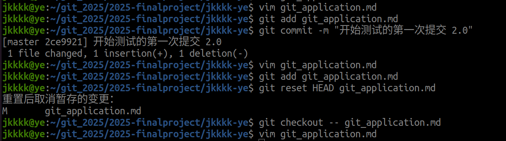

# 1.若你已经修改了部分文件、并且将其中的一部分加入了暂存区，应该如何回退这些修改，恢复到修改前最后一次提交的状态?给出至少两种不同的方法

***使用reset指令前一定要有一次提交***


## (1)分步回退

```bash
#释放暂存区文件到工作区，回退工作区未暂存的修改，文件恢复到最近一次提交状态
#A,
git resrt HEAD<文件>
#HEAD引用（HEAD是Git中指向最新提交的指针）
git checkout<文件>
# 
```


```bash
#B,
git restore --staged
#回退暂存区到工作区
git restore
#操作工作区
```

 

## （2）指定回/直接回

```bash 
git log --oneline#找到目标提交ID
git reset --hard <ID>#回到指定提交
```


```bash
`git reset --hard`#回到最近一次提交
```


## （3）临时提交一次后回退到修改前的提交

```bash
git add .
git commit -m "临时提交：用于退回到修改前的版本"
git reset --hard HEAD^#回到上一次提交
```


# 2.若你已经提交了一个新版本，需要回退该版本，应该如何操作?分别给出不修改历史或修改历史的至少两种不同的方式

## (1)保留历史

### 创建新提交

```bash
git log --oneline
git revert <ID>#revert生成反向修改的新提交，使代码回退但保留历史提交记录
```


### 只改工作区，不影响暂存区和提交历史

```bash
git log --oneline
git reset --source=<ID><文件>
```


## （不保留历史）

### 只修改本地仓库，暂存区和工作区不变

```bash
#--soft 参数只修改本地仓库，暂存区和工作区保留后续所有修改，可重新整理提交
git reset --soft<ID>
```


### 强制全退

```bash
git reset --hard <ID>
```


# 3.我们已经知道了合并分支可以使用 merge，但这不是唯一的方法，给出至少两种不同的合并分支的方式

## （1）变基合并

#### 创建仓库和分支

```bash 
git add .
git commit -m "首次提交以创建仓库"
git checkout -b test-rebase-1#创建分支并且切换到分支
```


#### 模拟分支提交

```bash
echo "1.0">>1.md#修改分支内容
git add .
git commit -m "分支1.0C"
```


#### 模拟主分支最新提交

```bash
git checkout master#切换到主分支
echo "master 1.0" >> 1.md
git add .
git commit -m "主分支提交1.0"
```


#### 进行基变操作，根据提示解决问题

```bash
git checkout test-rebase-1 #切换到分支
git rebase master #将test-rebase-1变基到master分支
#可以用 git add <文件>标记冲突解决
#解决问题后可以 git rebase --continue 继续变基
#切换到master分支，合并变基后的test-rebase-1分支
git checkout master
git merge test-rebase-1

```


## （2）cherry-pick

```bash
git init
vim test
git add .
git commit -m "首次提交：打开仓库"
#创建分支并提交
git checkout -b branch1
vim test
git add .
git commit -m "分支新提交"
#挑选提交合并
#获取分支ID
git log --oneline branch1
git cherry-pick <ID>
```


```bash
#检查合并
git log --oneline --graph
git log
```


## (3)squash

将功能分支的多个提交压缩为一个新提交，合并到主分支后历史线性

```bash
#模拟新分支提交
git checkout -b branch2
git add .
git commit -m "分支新新提交"
git checkout master
git merge --squash branch2
git commit -m "合并（压缩）branch2提交"
git log --oneline --graph
```


