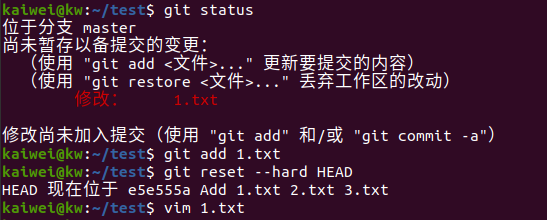
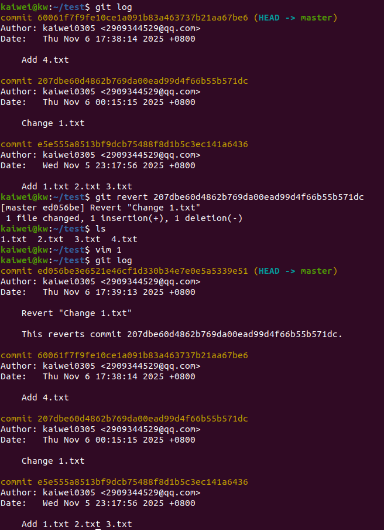
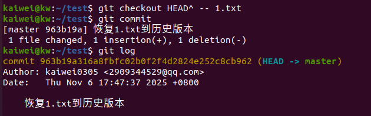
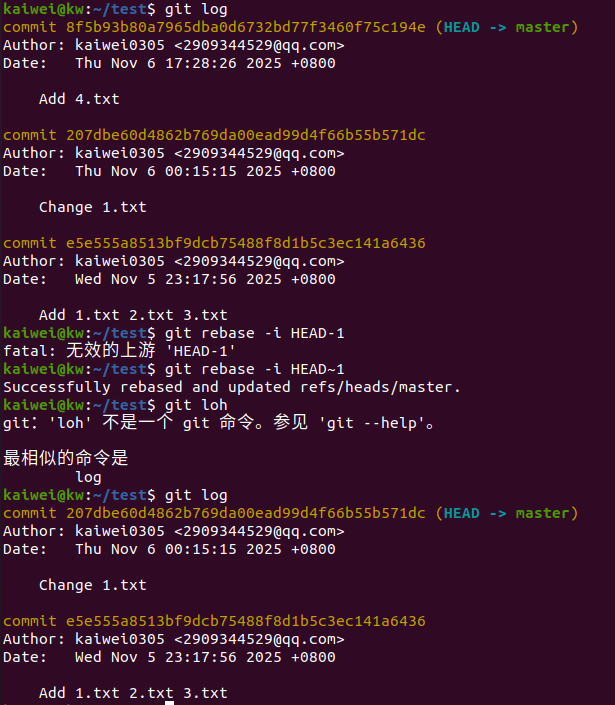
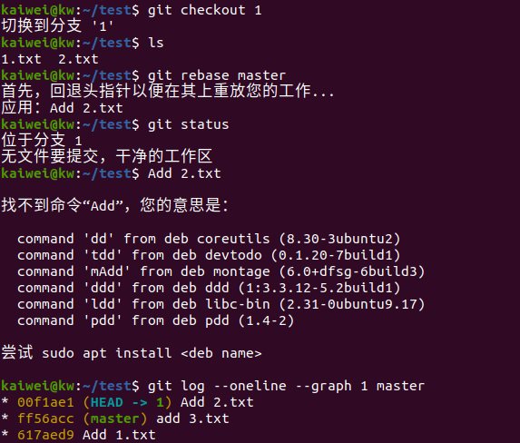
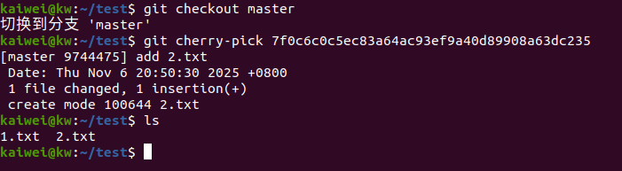
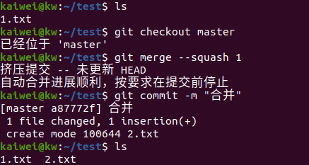

# Git 应用问题解答

## 问题1：回退修改，恢复到最后一次提交状态

当修改了部分文件且部分加入暂存区时，可通过以下方式回退：

### 方式一：使用 `git reset --hard HEAD`
该命令会**同时重置暂存区和工作区**到当前分支 `HEAD` 提交（即最后一次提交）的状态。执行后，所有未提交的修改（包括暂存区和工作区）会被强制丢弃，因此使用时需谨慎。





### 方式二：分步骤撤销暂存和工作区修改
1. **撤销暂存区修改**：使用 `git reset HEAD <file>`（`<file>` 为文件名，可指定多个或用通配符），将暂存区文件回退到工作区。

2. **撤销工作区修改**：使用 `git checkout -- <file>`，将工作区文件恢复到最后一次提交的状态。


## 问题2：回退已提交的新版本

针对已提交的新版本，可通过以下方式回退，分为**不修改历史**和**修改历史**两类：

### 一、不修改历史的方式

#### 方式一：使用 `git revert <commit>`
`git revert` 会创建**新的提交**来撤销指定 `<commit>` 的修改，不会改变历史提交记录，是多人协作场景下的安全回退方式。

步骤：
1. 执行 `git log` 查看要回退的提交哈希值。
2. 执行 revert 命令：
   ```bash
   git revert <commit哈希值>
   ```
3. 若出现冲突，解决冲突后提交即可。




#### 方式二：使用 `git checkout <commit> -- <file>`（单文件回退）
若仅需回退单个文件到历史版本，可直接从指定提交中检出该文件，不影响历史记录。




### 二、修改历史的方式

#### 方式一：使用 `git reset --soft <commit>'

HEAD 指针：会从当前提交移动到目标提交（即 “撤销” 了目标提交之后的所有提交记录）。暂存区（index）：保持不变（目标提交之后的所有暂存修改仍然保留在暂存区）。
 工作区（working directory）：保持不变（所有未提交的本地修改也会保留）。


#### 方式二：使用 `git rebase -i <commit>`（交互式变基）
通过交互式变基可删除、合并提交记录，实现历史修改。

步骤：
1. 执行交互式变基（如回退到前两个提交）：
   ```bash
   git rebase -i HEAD~2
   ```
2. 在编辑界面中，将目标提交的操作改为 `drop`，保存退出后完成历史修改。




## 问题3：合并分支的不同方式（除 `merge` 外）

除 `git merge` 外，还有以下合并分支的方式：

### 方式一：使用 `git rebase`（变基合并）
`git rebase` 会将当前分支的提交“搬移”到目标分支的最新提交之后，使提交历史更线性。




若出现冲突，解决后执行 `git rebase --continue`，完成后可切换到 `main` 分支执行 `git merge feature`（快进合并，历史更整洁）。

### 方式二：使用 `git cherry-pick`（挑选提交合并）
`cherry-pick` 可将其他分支的**单个或多个提交**“挑选”到当前分支，实现部分提交的合并。




若有冲突，解决后执行 `git cherry-pick --continue`。

### 方式三：使用 `git merge --squash`（压缩提交合并）
该命令会将目标分支的多个提交**压缩为一个提交**后再合并到当前分支，避免提交历史过于零散。





