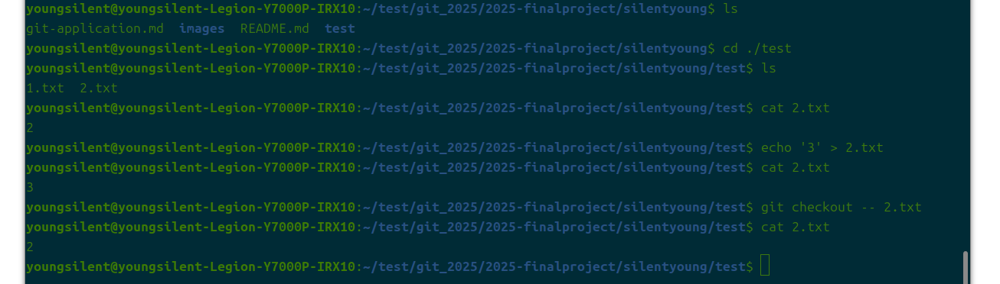
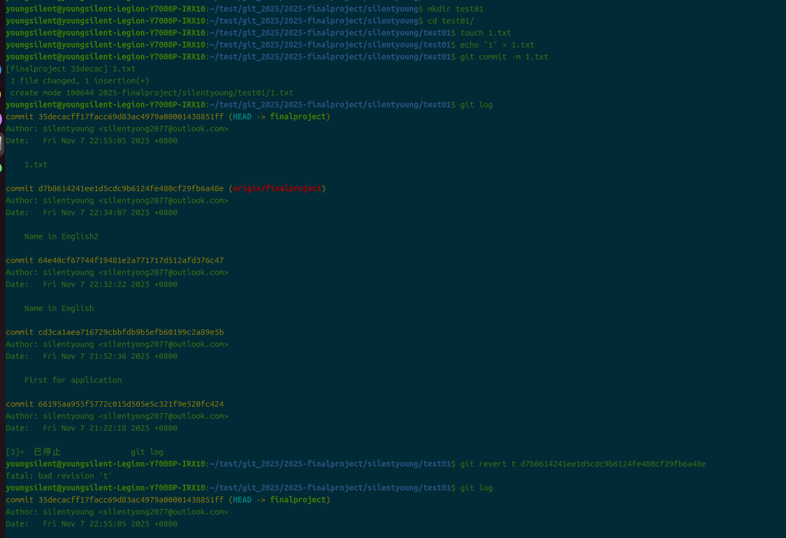
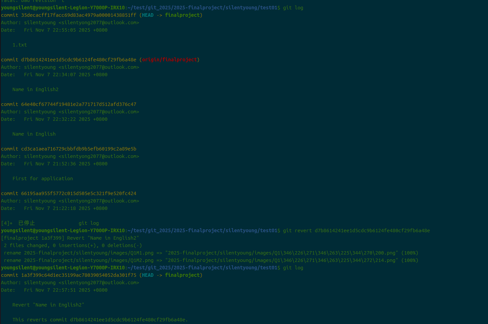
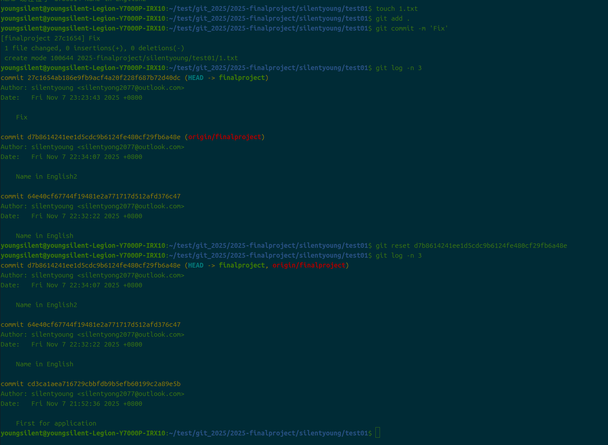
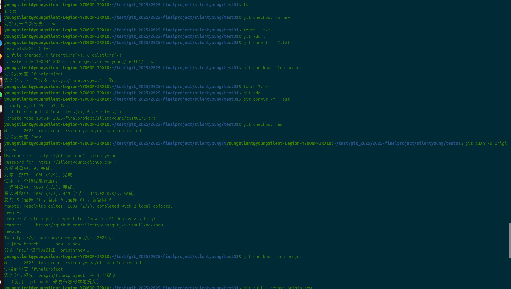
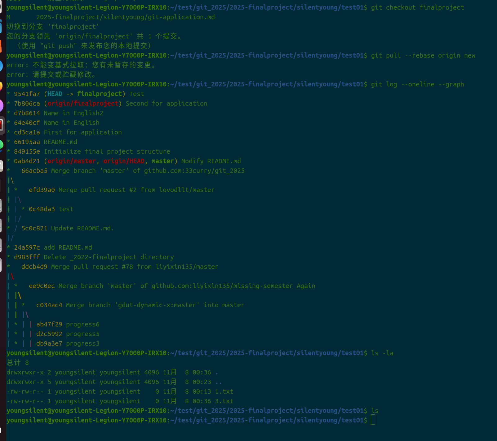

# **git应用**

## 1.*若你已经修改了部分文件、并且将其中的一部分加入了暂存区，应该如何回退这些修改，恢复到修改前最后一次提交的状态？给出至少两种不同的方式*
### (1)第一题第一种方法restore
### (2)第一题第二种方法checkout

## 2.*若你已经提交了一个新版本，需要回退该版本，应该如何操作？分别给出不修改历史或修改历史的至少两种不同的方式*
### (1)第二题第一种方法revert
### (2)第二题第二种方法reset
*只能想到这么多方法了，不是没有审题 T.T*

## 3.*我们已经知道了合并分支可以使用 merge，但这不是唯一的方法，给出至少两种不同的合并分支的方式*
### (1)第三题第一种方法merge
### (2)第三题第二种方法pull --rebase

***个人能力有限，只能到这里了***

未完待续……

