# git 应用

**一、若你已经修改了部分文件、并且将其中的一部分加入了暂存区，应该如何回退这些修改，恢复到修改前最后一次提交的状态？给出至少两种不同的方式：**

1. 用以下指令会直接恢复到修改前，之前该的内容将不复存在

   ```bash
   git reset --hard HEAD
   ```

   - 此处修改了一个文件加了“Make one revision”

   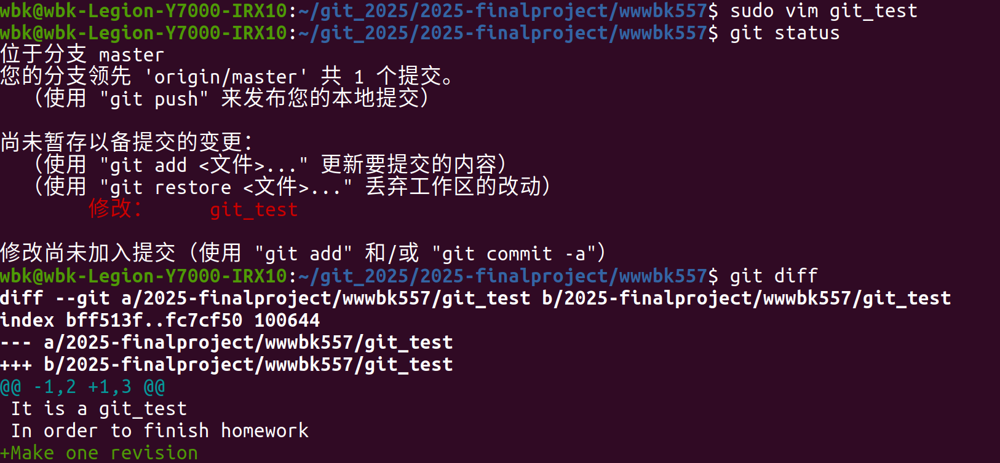

   - 如下我使用指令后回归上一次提交状态

   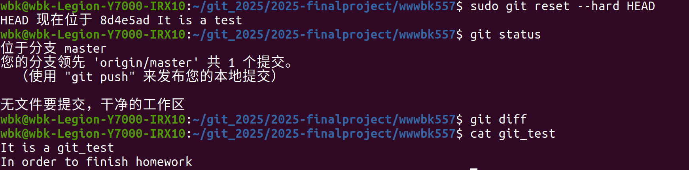

2. 先取消暂存再恢复

   - 先通过以下代码取消暂存

   ```bash
   git reset HEAD<文件名>
   ```

   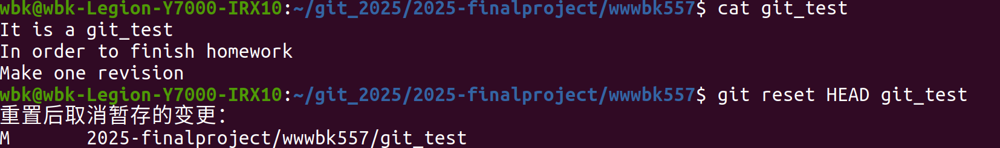

   - 再通过以下代码恢复到上一次提交状态
   
   ```bash
   git checkout -- <文件名>
   ```
   
   


**二、若你已经提交了一个新版本，需要回退该版本，应该如何操作？分别给出不修改历史或修改历史的至少两种不同的方式：**

1. 不修改历史

- git reset  回退后强制推送新提交（保留历史但追加）

  ```bash
  # 先回退到目标版本（保留工作区更改）
  git reset --soft <回退目标哈希>
  ```
  

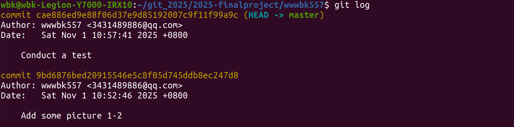

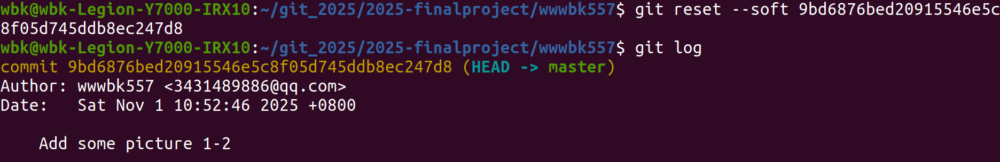

```bash
# 重新提交更改（生成新提交）
git commit -m "Revert to <目标哈希> by reset + recommit"
```

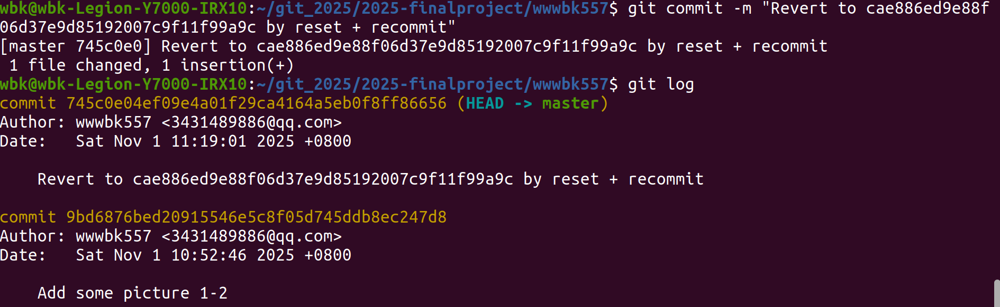

- git revert  生成反向提交

  ```bash
  # 回退指定提交（生成一个新提交，抵消目标提交的更改）
  git revert <要回退的提交哈希>
  
  # 若该提交是合并提交，需指定父分支（如 -m 1）
  git revert -m 1 <合并提交的哈希>
  ```

  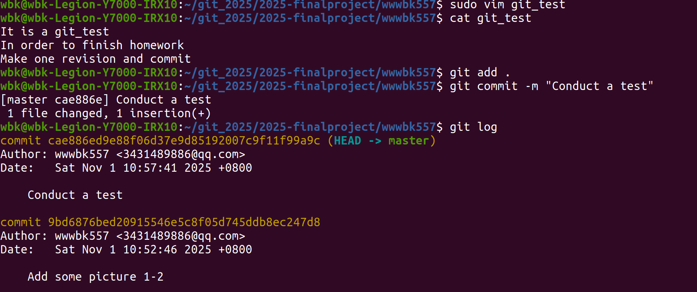

  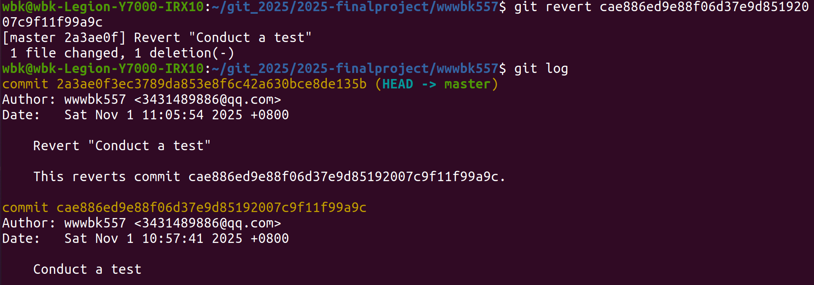

  

2. 修改历史

- git reset --hard  强制回退

  ```bash
  # 本地回退到目标版本（彻底丢弃后续提交）
  git reset --hard <回退目标哈希>
  ```

  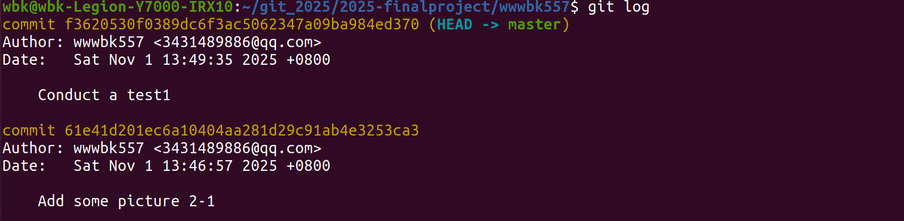

  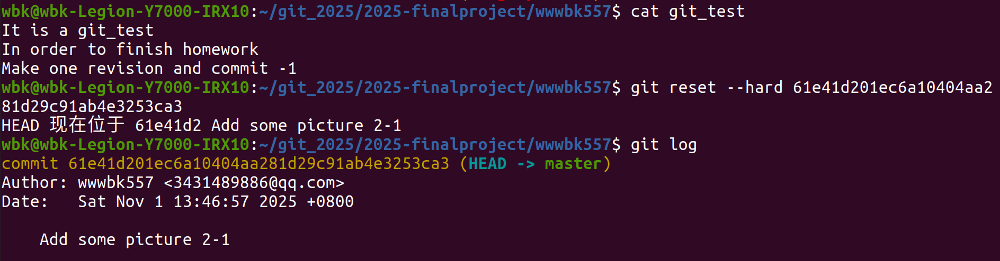

  工作区的也会被退到相应版本（最后一行少一个-1）

  

- git rebase -i  交互式删除提交

  ```bash
  # 打开交互式 rebase 编辑器（从当前分支的某个祖先开始）
  git rebase -i <回退目标哈希>^
  
  # 在编辑器中删除（drop）或注释掉要回退的提交行
  # 保存退出后，Git会重写历史
  ```
  
  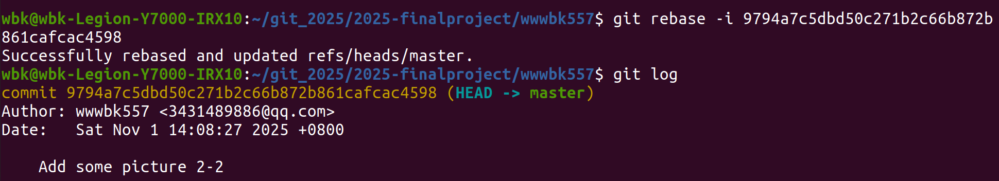
  
  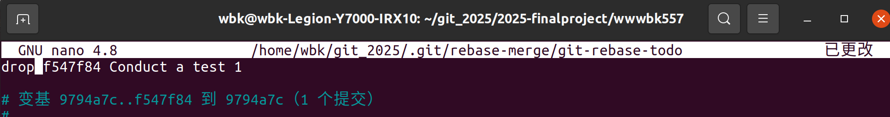

**三、我们已经知道了合并分支可以使用merge，但这不是唯一的方法，给出至少两种不同的合并分支的方式：**

1. 变基式合并 —— `git rebase`

   把当前分支的整条提交历史搬到目标分支最新提交之后，形成一条直线，看上去像顺序开发

   ```bash
   git checkout feature
   git rebase master        
   git checkout master
   git merge feature        
   ```
   
   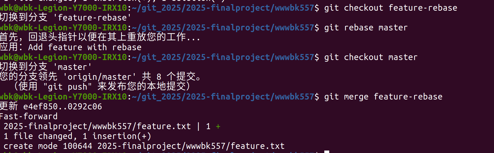
   
2. 拣选式合并 —— `git cherry-pick`

   只摘取指定的一个或多个提交应用到当前分支，其余提交不管

   ```bash
   git checkout master
   git cherry-pick 3a2f1d8 7b9c4e2   # 把两条补丁依次搬过来
   ```

   先创建一个新分支再提交点东西
   
   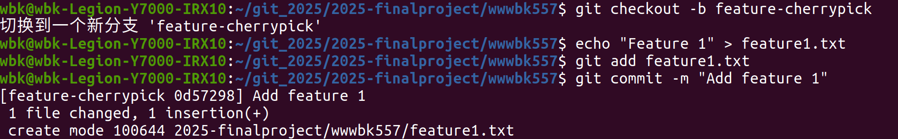
   
   查看提交历史，获取提交的哈希值
   
   
   
   使用cherry-pick选择性地合并某个提交
   
   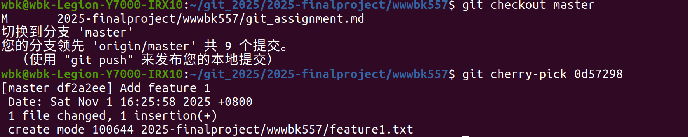


